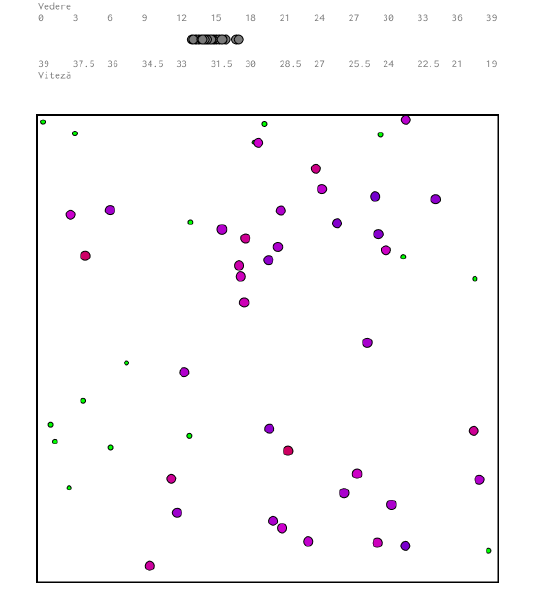

## NatSel

This is a project that simulates the natural selection of creatures that 
evolve toward a balance between perception range and movement 
speed in order to feed and reproduce.

A screenshot taken during running:

